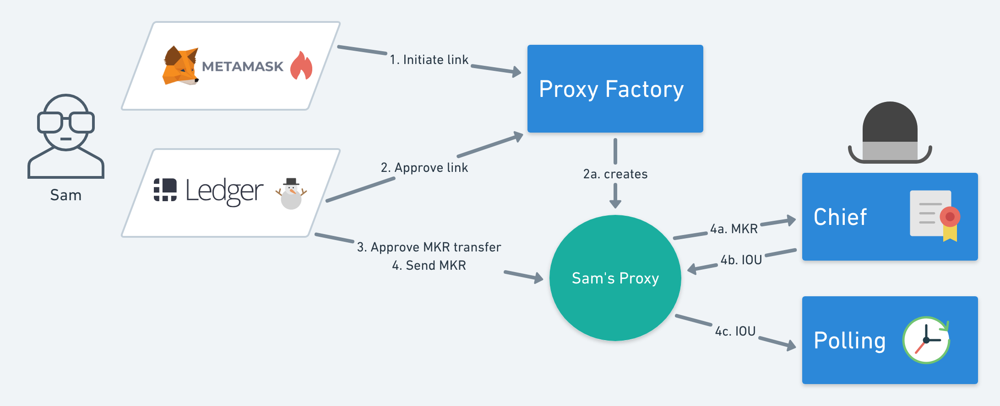

This repository contains a general voting contract designed to be the community polling counterpart to [ds-chief](https://github.com/dapphub/ds-chief)

## Requirements and design considerations
https://makerdao.atlassian.net/wiki/spaces/MGV/pages/468910091/Symbolic+Voting

## Proposed integration with a proxy voting contract & DS chief

